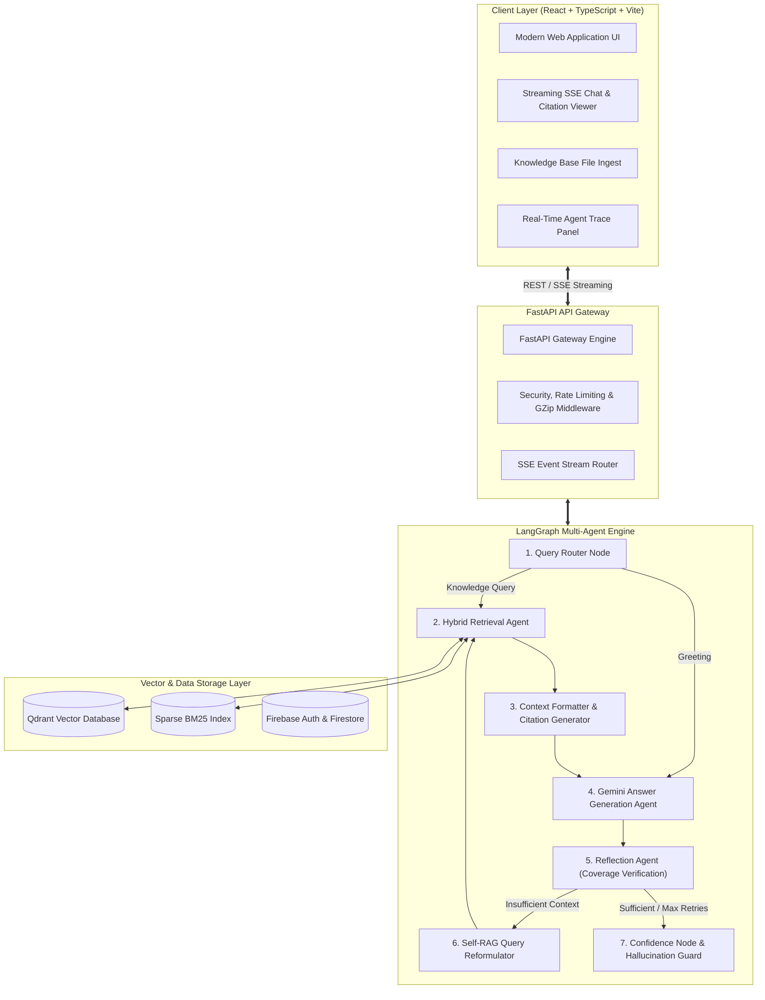

# Agentic RAG Knowledge Assistant

> Production-Ready Enterprise Knowledge Assistant featuring Stateful LangGraph Orchestration, Self-RAG Reflection Loops, Google Gemini LLM Synthesis, Hybrid Search (Dense Vector + BM25 + RRF + Cross-Encoder Reranking), and a Modern Glassmorphism React UI.

---

## 1. Project Overview

The **Agentic RAG Knowledge Assistant** solves the core flaws of naive Retrieval-Augmented Generation systems—such as hallucinations, context dilution, and lack of self-correction—by embedding stateful multi-agent DAG workflows into the retrieval process. Built with **LangGraph**, **Google Gemini**, **Qdrant Vector DB**, and **FastAPI**, it delivers grounded, citation-backed answers with explicit confidence metrics (0–100%).

---

## 2. Key Features

- **Stateful Multi-Agent Workflow Engine**: Driven by LangGraph (`Query Router` → `Retrieval Agent` → `Context Formatter` → `Answer Generation Agent` → `Reflection Agent` → `Self-RAG Loop` / `Confidence Node`).
- **Self-RAG & Corrective Reflection**: Evaluates document grounding and query coverage. If evidence is insufficient, automatically reformulates queries and retries retrieval (max 2 retries).
- **Hallucination Guard & Confidence Scoring**: Computes explicit grounding confidence metrics (0–100%) and triggers Hallucination Guards if knowledge base context is insufficient.
- **Hybrid Retrieval & Reranking**: Reciprocal Rank Fusion (RRF) blending sparse BM25 keyword matching with dense Qdrant vector embeddings.
- **Modern Glassmorphism UI**: Vite + React 18 + TypeScript + Tailwind CSS with dark/light mode switching, toast alerts, 10 application views, and real-time Server-Sent Events (SSE) token streaming.
- **Real-Time Agent Thought Trace Panel**: Side drawer displaying live step-by-step agent reasoning steps, confidence scores, and source citations.
- **Firebase Auth & Firestore**: Email/Password authentication, user session persistence, and Firestore profile collections.

---

## 3. Screenshots & Visual Interface

| Application View | Feature Description |
|:---|:---|
| **Dashboard** | Overview banner, AI accuracy metrics (96.4%), quick file ingest actions, and active session launchers. |
| **Agentic Chat** | ChatGPT-like layout with SSE token streaming, inline citation cards (`[Source 1: filename]`), copy answer action, and stop/regenerate controls. |
| **Agent Thought Trace** | Real-time side drawer revealing LangGraph execution steps, confidence scores, and Self-RAG reflection logs. |
| **Knowledge Base Manager** | Drag-and-drop file upload (PDF, DOCX, TXT, MD), chunk inspection, search filter, and document deletion. |

---

## 4. Architecture Diagram



---

## 5. Installation Guide

### Prerequisites
- Node.js v18+ & npm v9+
- Python 3.11+
- Git

### Backend Setup
1. Change directory to `backend/`:
   ```bash
   cd backend
   python -m venv venv
   # On Windows:
   .\venv\Scripts\activate
   # On Unix:
   source venv/bin/activate
   pip install -r requirements.txt
   ```
2. Create `.env` file in `backend/`:
   ```env
   GEMINI_API_KEY="your-google-gemini-api-key"
   ENVIRONMENT="development"
   ```
3. Start the FastAPI development server:
   ```bash
   uvicorn main:app --reload --port 8000
   ```
   API Docs will be live at `http://localhost:8000/docs`.

### Frontend Setup
1. Change directory to `frontend/`:
   ```bash
   cd frontend
   npm install
   ```
2. Create `.env.local` file in `frontend/`:
   ```env
   VITE_API_BASE_URL="http://localhost:8000/api/v1"
   VITE_FIREBASE_API_KEY="AIzaSy..."
   VITE_FIREBASE_PROJECT_ID="agentic-rag-assistant-11e0b"
   ```
3. Start the Vite dev server:
   ```bash
   npm run dev
   ```
   Frontend will be live at `http://localhost:5173`.

---

## 6. Environment Variables

| Variable | Scope | Description |
|:---|:---|:---|
| `GEMINI_API_KEY` | Backend | Google Gemini API Key for Chat & Embeddings. |
| `ENVIRONMENT` | Backend | Application mode (`development` / `production`). |
| `QDRANT_HOST` | Backend | Qdrant Vector DB host (`localhost` / `qdrant`). |
| `VITE_API_BASE_URL` | Frontend | FastAPI backend base URL endpoint. |
| `VITE_FIREBASE_API_KEY` | Frontend | Firebase web API credential key. |
| `VITE_FIREBASE_PROJECT_ID` | Frontend | Firebase project identifier. |

---

## 7. Deployment Guide

### Deploying Frontend to Vercel
1. Connect your repository to **Vercel**.
2. Set Root Directory to `frontend`.
3. Framework Preset: **Vite**.
4. Add environment variables (`VITE_API_BASE_URL`, `VITE_FIREBASE_*`).
5. Vercel will deploy automatically using `frontend/vercel.json`.

### Deploying Backend to Render
1. Connect repository to **Render**.
2. Select **Web Service** using `render.yaml`.
3. Set Build Command: `pip install -r backend/requirements.txt`.
4. Set Start Command: `cd backend && uvicorn main:app --host 0.0.0.0 --port $PORT`.
5. Add `GEMINI_API_KEY` environment variable.

### Running with Docker Compose
```bash
docker-compose up --build -d
```
App will be running on `http://localhost` (Frontend NGINX port 80) and `http://localhost:8000` (FastAPI backend).

---

## 8. API Documentation

| Endpoint | Method | Description |
|:---|:---|:---|
| `/api/v1/health` | `GET` | Liveness probe returning server status and uptime. |
| `/api/v1/ready` | `GET` | Readiness probe verifying vector store & cache state. |
| `/api/v1/metrics` | `GET` | Telemetry probe returning cache hit rates and system performance metrics. |
| `/api/v1/chat` | `POST` | Executes LangGraph Self-RAG Chat workflow with streaming SSE response (`text/event-stream`). |
| `/api/v1/documents/ingest` | `POST` | Upload document file (PDF, DOCX, TXT, MD) to parse, chunk, embed, and index. |
| `/api/v1/documents/preview-chunking` | `POST` | Preview semantic chunk breakdown without persisting vectors. |

---

## 9. Project Folder Structure

```text
agentic-rag-assistant/
├── README.md
├── docker-compose.yml
├── render.yaml
├── Makefile
├── .env.example
├── .gitignore
├── .github/
│   └── workflows/
│       └── ci-cd.yml             # GitHub Actions CI/CD Pipeline
├── frontend/                     # React 18 + TypeScript + Vite Client
│   ├── package.json
│   ├── vite.config.ts
│   ├── vercel.json
│   ├── nginx.conf
│   ├── Dockerfile
│   └── src/
│       ├── components/           # Navbar, Sidebar, ChatBubble, CitationCard, FileUploader, AgentTracePanel
│       ├── context/              # AuthContext, ThemeContext, ToastContext
│       ├── pages/               # Landing, Login, Register, ForgotPassword, Dashboard, Chat, Documents, Profile, Settings, About
│       └── services/             # apiService.ts
└── backend/                      # Python FastAPI & LangGraph Microservice
    ├── requirements.txt
    ├── Dockerfile
    ├── main.py                   # FastAPI Gateway with GZip, CORS, Security Headers
    ├── app/
    │   ├── core/                 # Settings, Structured Logging, Rate Limiter & Security
    │   ├── llm/                  # Gemini Chat & Embedding Model configurations
    │   ├── agents/               # LangGraph StateGraph Engine, Reflection & Self-RAG Nodes
    │   ├── api/                  # SSE Chat API, /health, /ready, /metrics
    │   ├── ingestion/            # Document Parser, Semantic Chunker, Embedder
    │   └── services/             # Cache Service, Vector Store (Qdrant), BM25 & Hybrid Engine
    └── tests/                    # Pytest Suite (test_health.py, test_documents.py, test_chat.py)
```

---

## 10. Future Improvements

- Multimodal ingestion for images and scanned OCR documents.
- Multi-workspace RBAC permissions with team sharing.
- Automated evaluation dashboard using Ragas and LangSmith tracing.

---

## 11. License

MIT License © 2026 Agentic RAG Knowledge Assistant Team.
